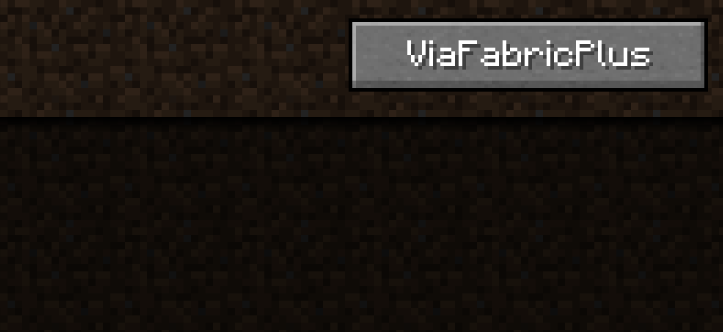
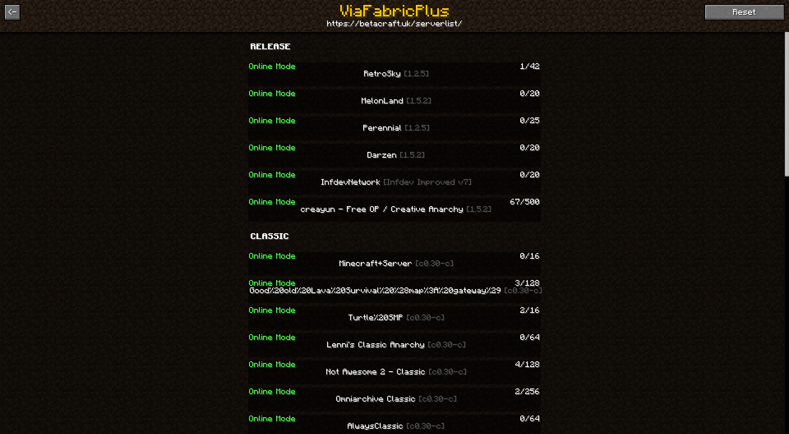

# Settings and GUI
In the multiplayer screen you will find the ViaFabricPlus button in the upper left corner by default, it is the main button,
click on it, and you will see the Protocol selection, there you can choose the Minecraft version you want to connect to, 
in the upper left corner you can go to the Settings.

In the Add/Edit Server screen there is a button where you can select a specific version for this server, when you ping or connect to this server, 
ViaFabricPlus will use the version set there, the versions are stored in the servers.dat too

If you don't want to specify a specific version anymore, you can simply press the button and select **"Cancel and reset"**.

## Commands
You can use the ViaVersion commands with **/viafabricplus** or **/viaversion**, and a few classic only commands are also implemented:
- **/viafabricplus settime <Time (Long)>** - Changes the Clientside World Time, available from: **c0.28-c0.30**
- **/viafabricplus listextensions** - Displays all classic protocol extensions, available in: **c0.30 CPE**

### Settings are optional settings that can turn fixes on and off, originally they were used for debugging 

## Bedrock edition
Keep in mind that the Java -> Bedrock support is still in beta phase, and therefore many things are not implemented
yet and there is no guarantee that everything will work as it should.

To log in to a Bedrock account you can press the button **"Click to set account for Bedrock edition"** in the settings,
then you can log in via device login, the account logged in there will be stored in **~/ViaFabricPlus/bedrock.account**.

## ClassiCube and BetaCraft integration
In the main GUI there is an extra button for ClassiCube and BetaCraft, both buttons send API requests to the respective platforms to get the respective server list.
## BetaCraft

## ClassiCube

For ClassiCube you need an account, which you can make on the official website (https://www.classicube.net/), in case ClassiCube requires MultiFactor, an extra GUI will open in ViaFabricPlus.

